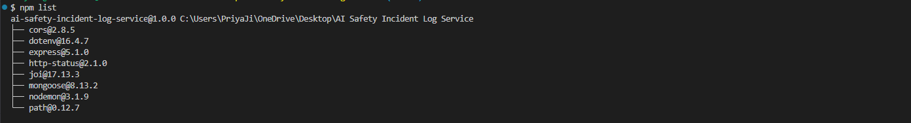

# AI Safety Incident Log Service

## Overview
This is a simple RESTful API service built with Node.js, Express.js, and MongoDB to log and manage AI safety incidents.

## Features
- Create, retrieve, and delete AI safety incidents.
- Uses MongoDB for persistent storage.
- MongoDB as the database with Mongoose ORM.
- Request validation using Joi.
- Implements basic validation and error handling.
- API error handling with custom error classes.
- Supports CORS for cross-origin requests.

## Prerequisites
- **Node.js** (>= 14.x recommended)
- **MongoDB** (running locally or in the cloud, e.g., MongoDB Atlas)

## Clone the Repository

```bash
git clone https://github.com/surendergupta/AI-Safety-Incident-Log-Service.git
cd AI-Safety-Incident-Log-Service
```

## Install Dependencies
```bash
npm install
```

## Install Packages
```bash
npm i cors
npm i dotenv --save
npm i express
npm i http-status
npm i joi
npm i mongoose
npm i nodemon --save-dev
npm i path
```



## Set Up Environment
Create a .env file in the project root with:
```.env
PORT=5000
MONGO_URI=mongodb://localhost:27017/ai_safety_log_api_db  # Update this if using MongoDB Atlas
NODE_ENV=development
```

## Start the Server
```bash
npm start
npm run dev
```

Server will run at: http://localhost:5000

## API Endpoints
### Retrieve all incidents
GET /incidents


### Create a new incident
Endpoint: POST /incidents
```bash
curl -X POST http://localhost:5000/incidents \
  -H "Content-Type: application/json" \
  -d '{
    "title": "System Crash",
    "description": "The AI system crashed due to memory leak.",
    "severity": "High"
  }'
```
Response:
```json
{
    "title": "System Crash",
    "description": "The AI system crashed due to memory leak.",
    "severity": "High",
    "_id": "67f2ce5f80c47f6c3071547f",
    "reported_at": "2025-04-06T18:56:31.124Z",
    "__v": 0
}
```


### Retrieve an incident by ID
GET /incidents/:id

```bash
curl -X GET http://localhost:5000/incidents/67f2ce5f80c47f6c3071547f
```

Response:

```json
{
    "_id": "67f2ce5f80c47f6c3071547f",
    "title": "System Crash",
    "description": "The AI system crashed due to memory leak.",
    "severity": "High",
    "reported_at": "2025-04-06T18:56:31.124Z",
    "__v": 0
}
```

### Delete an incident
DELETE /incidents/:id

```bash 
curl -X DELETE http://localhost:5000/incidents/67f2ce5f80c47f6c3071547f
```
Response:

```json
{
    "message": "Incident deleted successfully"
}

```
## Database Setup (Optional)
This API uses MongoDB. Ensure your database is running before starting the server.
Mongoose will automatically create the required collections based on the following schema:

```
const mongoose = require("mongoose");
const incidentSchema = new mongoose.Schema({
  title: { type: String, required: true, minlength: 3, maxlength: 100 },
  description: { type: String, required: true, minlength: 10, maxlength: 500 },
  severity: { type: String, enum: ["Low", "Medium", "High"], required: true },
}, { timestamps: true });

module.exports = mongoose.model("Incident", incidentSchema);
```

To add sample incidents manually, insert the following into MongoDB:
```sh
mongo
use ai_safety_log_api_db
db.incidents
```

## Design Decisions & Challenges

- Validation: Used Joi for strict input validation to prevent bad data.
- Error Handling: Custom ApiError class ensures structured error responses.
- Scalability: MongoDB was chosen for flexible document storage.